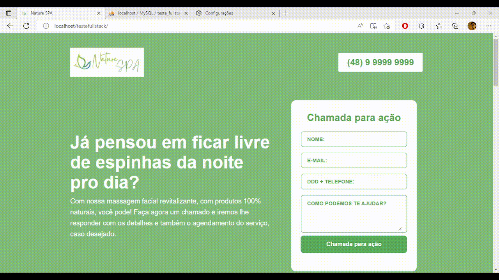

teste rodando em live: https://teste-fullstack-ellos.leudoneto.repl.co/

# Documentação do projeto

## Para executar com WampServer

>  <a href="https://github.com/LeudoNeto/teste-frontend-developer.git">**<h2>Git Clone</h2>**</a>
> 
> - ` 1. ` No arquivo `Chamada.php` altere a função `connection` com as informações para autenticação do seu banco de dados. (Por padrão vem a conexão para um MySQL de endereço localhost, para usuário root, sem senha e que acessa o banco de dados "teste_fullstack")
>
> - ` 2. ` No seu banco de dados execute a query do arquivo `teste_fullstack.sql` para criar a tabela que será utilizada.
> 
> - ` 3. ` Após isso copie a pasta com todos os arquivos e cole-a em `\wamp64\www` no seu computador.
>
> - ` 4. ` Com todos os serviços do Wamp ativados, vá ao seu navegador e digite `localhost/teste-frontend-developer`.

## Para executar com alguma IDE

>  <a href="https://github.com/LeudoNeto/teste-frontend-developer.git">**<h2>Git Clone</h2>**</a>
> 
> - ` 1. ` Abra um `workspace` na pasta `teste-frontend-developer`.
>
> - ` 2. ` No arquivo `Chamada.php` altere a função `connection` com as informações para autenticação do seu banco de dados. (Por padrão vem a conexão para um MySQL de endereço localhost, para usuário root, sem senha e que acessa o banco de dados "teste_fullstack")
>
> - ` 3. ` No seu banco de dados execute a query do arquivo `teste_fullstack.sql` para criar a tabela que será utilizada.
>
> - ` 4. ` Vá ao arquivo index.php, e no terminal execute `php -S 0.0.0.0:8000`
>
> - ` 5. ` No navegador acesse `localhost:8000`
>

# Documentação do código

## Chamada.php

O back-end utiliza Orientação a Objetos, e nesse arquivo está a classe Chamada, que corresponderá a cada formulário enviado no index.php, a classe possui os métodos:

> - setName, setEmail, setPhone e setRequest, que no index.php definirá os atributos da instância, a partir do que foi inserido pelo usuário no formulário.
>
> - getName, getEmail, getPhone e getRequest, que são responsáveis por retornar seus respectivos atributos da instância, no método que irá fazer o INSERT no banco de dados.
>
> - connection, que é responsável pela conexão com o banco de dados.
>
> - create, que é responsável pelo INSERT no banco de dados das informações extraídas do formulário (que utiliza do método HTTP POST) preenchido pelo usuário.

## index.php

A própria landing page, dividida em seis seções, cada qual com uma divisão da cor do plano de fundo da página. Na primeira seção está a parte fundamental do projeto, o `formulário` que recebe os dados do usuário, e ao clicar no botão de envio, mostra embaixo dele se os dados foram inseridos com sucesso no banco ou se houve algum erro. A página utiliza externamente o arquivo `Chamada.php`, explicado anteriormente para que serve, e também aos arquivos `script.js` e `styles.css` 

## script.js

O JavaScript do projeto, tendo as seguintes funcionalidades:

> - As duas primeiras funções são responsáveis por automaticamente formatar o número de telefone do usuário (colocando os parênteses e o hífen). `formatPhoneNumber` faz o `replace` do que está sendo digitado pelo usuário, aceitando apenas números e preenchendo os parênteses e aspas nos lugares certos, `phoneNumberFormatter` apenas faz a conexão do `input` do html com a função anterior.
>
> - A segunda parte do código (delimitada pelos comentários) é a que faz com que os botões da seção `Perguntas Frequentes` façam aparecer suas respectivas respostas logo abaixo.
>
> - A terceira e última parte é a responsável por fazer todos os botões de `Chamada para ação` (fora o que se localiza no formulário), realizarem o scroll da tela até o formulário.

OBS: mesmo com o teste permitindo o uso de jQuery eu optei por não utilizar já que tudo que eu pretendia já era possível com o JavaScript vanilla mesmo.

## styles.css

O CSS do projeto, responsável principalmente pela parte responsiva, fazendo com que caso o site estivesse sendo visto em aparelhos de tela menor, os itens que se encontravam à direita (nas seções que haviam uma divisão clara) fossem mostrados abaixo dos que estavam à esquerda, ficando ambos centralizados. Além da responsividade, todos os esquemas de espaçamento, cores e animações estão disponíveis nele.

# Testes funcionando:

## Landing page e animações:

## Formulário:

